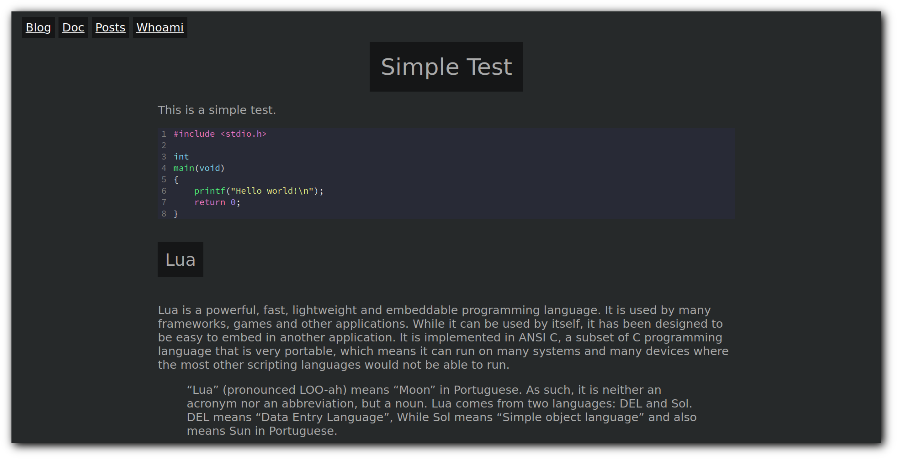

# Hos's Hugo Theme

A simple Hugo theme based on [lugo](github.com/LukeSmithxyz/lugo) I plan on
using for my personal website.

## get started

```sh
hugo new site new-site
cd new-site
git clone https://github.com/hossein-lap/allgray themes/cbail
echo "theme = 'allgray'" >> config.toml
cp themes/allgray/static/style.css static/
```

## stuff

- Makes one RSS feed for the entire site at `/index.xml`
- Stylesheet is in `/style.css` and includes some important stuff for partials.
- If a post is tagged, links to the tags are placed at the bottom of the post.
- `nextprev.html` adds links to the Next and Previous articles to the bottom of a page.
- `taglist.html` links all tags an article is tagged to for related content.

## screenshot


